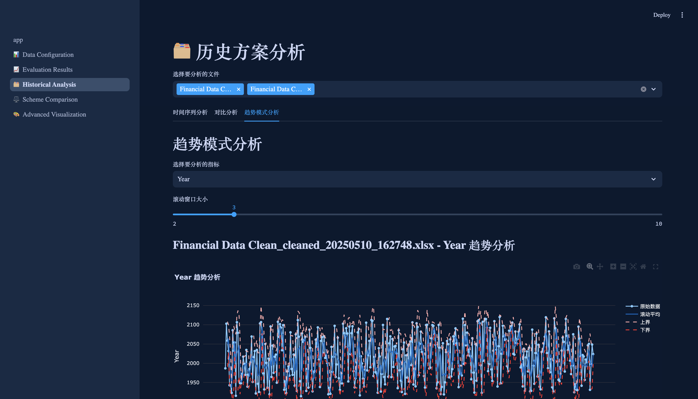
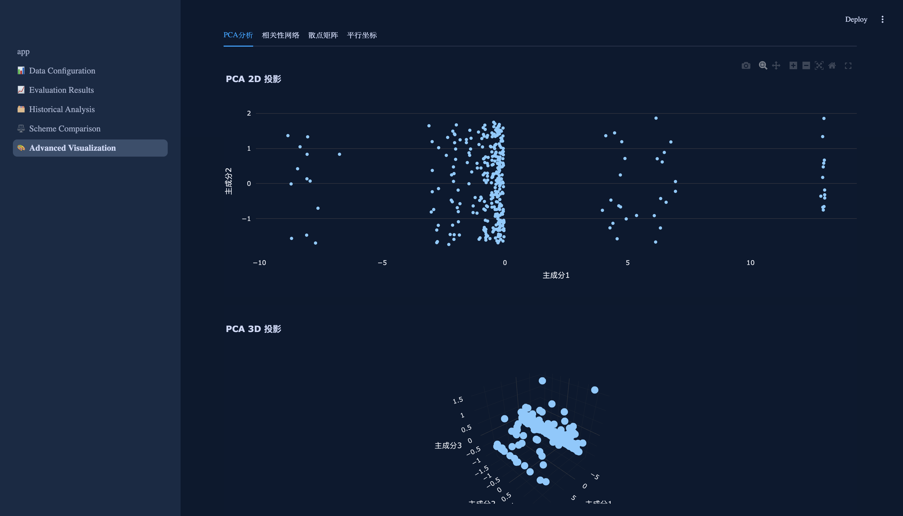

# DataViz Pro - Data Visualization Expert

## Project Overview
DataViz Pro is a professional data visualization analysis platform focused on data feature analysis, multi-dimensional visualization, and solution comparison. Through its intelligent data processing engine and rich visualization components, it helps users quickly gain insights into data features, discover data patterns, perform deep analysis, and optimize solutions.

### Core Advantages
- **Intelligent Feature Analysis**: Automatic feature recognition with professional analysis recommendations
- **Multi-dimensional Visualization**: Support for various chart types to meet different analysis scenarios
- **Deep Data Insights**: Uncover potential data value through advanced analysis algorithms
- **Flexible Solution Comparison**: Support for parallel solution comparison to aid decision optimization
- **Interactive Experience**: Intuitive interface with smooth interaction

## Features

### Data Configuration & Management
- **Smart Data Import**
  - Support for multiple data formats (Excel, CSV, JSON, Parquet)
  - Automatic data format recognition
  - Intelligent encoding detection
  - Data preview and validation

- **Feature Engineering**
  - Automatic feature recognition and classification
  - Feature importance analysis
  - Feature correlation analysis
  - Feature distribution analysis

- **Data Cleaning**
  - Intelligent missing value handling
  - Outlier detection and processing
  - Data format standardization
  - Duplicate data cleaning

### Analysis Results Display
- **Multi-dimensional Visualization**
  - Basic statistical charts
  - Advanced analysis charts
  - Interactive charts
  - Custom charts

- **Deep Analysis**
  - Trend analysis
  - Correlation analysis
  - Distribution analysis
  - Predictive analysis

### Historical Data Analysis
- **Time Series Analysis**
  - Trend decomposition
  - Seasonal analysis
  - Cyclical analysis
  - Predictive analysis

- **Comparative Analysis**
  - Time dimension comparison
  - Feature dimension comparison
  - Solution effectiveness comparison
  - Optimization suggestions

### Solution Comparison
- **Multi-solution Parallel**
  - Solution feature comparison
  - Effectiveness difference analysis
  - Optimization space assessment
  - Decision recommendations

- **Visualization Comparison**
  - Multi-dimensional comparison charts
  - Difference heatmaps
  - Radar chart comparison
  - Trend comparison

### Deep Visualization
- **Dimensionality Reduction**
  - PCA principal component analysis
  - t-SNE dimensionality reduction
  - UMAP manifold learning
  - Cluster visualization

- **Network Analysis**
  - Correlation networks
  - Hierarchical structure analysis
  - Dynamic network analysis
  - Community detection

## Technical Architecture

### Technology Stack
```
Frontend Framework:
- Streamlit >= 1.32.0
- Plotly >= 5.18.0
- Graphviz >= 0.20.0

Data Processing:
- Pandas >= 2.2.0
- NumPy >= 1.26.0
- Scikit-learn >= 1.5.0

Development Tools:
- Python >= 3.8
- Git
- Docker (optional)
```

### Project Structure
```
project_root/
├── app.py                 # Main application entry
├── pages/                 # Page modules
│   ├── 1_📊_Data_Configuration.py    # Data configuration page
│   ├── 2_📈_Analysis_Results.py      # Analysis results page
│   ├── 3_🗂️_Historical_Analysis.py   # Historical analysis page
│   ├── 4_⚖️_Comparison_Analysis.py   # Comparison analysis page
│   └── 5_🎨_Advanced_Visualization.py # Deep visualization page
├── data/                  # Data directory
│   ├── uploaded_files/    # Uploaded data files
│   ├── processed_files/   # Processed data files
│   └── config/           # Configuration files
│       ├── features/     # Feature configuration
│       └── rules/        # Processing rules
├── utils/                # Utility functions
│   ├── data_processor.py # Data processing tools
│   ├── visualizer.py     # Visualization tools
│   ├── validator.py      # Data validation tools
│   └── cache_manager.py  # Cache management tools
├── assets/              # Static resources
│   ├── css/            # Style files
│   │   └── custom_style.css
│   ├── images/         # Image resources
│   └── icons/          # Icon resources
├── tests/              # Test directory
│   ├── unit/          # Unit tests
│   ├── integration/   # Integration tests
│   └── performance/   # Performance tests
└── .streamlit/        # Streamlit configuration
    └── config.toml    # Theme and server configuration
```

## Installation

1. Create virtual environment:
```bash
python -m venv venv
source venv/bin/activate  # Linux/Mac
# or
venv\Scripts\activate  # Windows
```

2. Install dependencies:
```bash
pip install -r requirements.txt
```

3. Run the application:
```bash
streamlit run app.py
```

## User Guide

### Data Import
1. Prepare data files (supports Excel, CSV, JSON, Parquet formats)
2. Click "Upload File" on the data configuration page
3. Wait for system to automatically analyze data features
4. View data preview and feature analysis results

### Data Analysis
1. Select the dataset to analyze
2. Choose analysis dimensions and methods
3. View analysis results and visualization charts
4. Export analysis reports

### Solution Comparison
1. Select solutions to compare
2. Set comparison dimensions and metrics
3. View comparison results and difference analysis
4. Get optimization suggestions

## Configuration

### Data Configuration
```json
{
  "data_config": {
    "file_types": ["xlsx", "csv", "json", "parquet"],
    "max_size_mb": 100,
    "encoding": "utf-8",
    "date_formats": ["%Y-%m-%d", "%Y/%m/%d", "%d-%m-%Y"],
    "numeric_precision": 2,
    "categorical_threshold": 0.1
  }
}
```

### Visualization Configuration
```json
{
  "theme_config": {
    "primary_color": "#1E88E5",
    "secondary_color": "#42A5F5",
    "background_color": "#121212",
    "text_color": "#FFFFFF",
    "font_family": "Roboto",
    "font_size": 14
  }
}
```

## Project Screenshots

### Data Configuration Page

- File upload and management
- Data feature analysis
- Dynamic column mapping
- Data preview

### Analysis Results Page

- Multi-dimensional data visualization
- Dynamic data feature extraction
- Correlation analysis
- Trend analysis

### Historical Analysis Page

- Time series analysis
- Comparative analysis
- Pattern recognition

### Solution Comparison Page

- Dynamic data feature comparison
- Multi-dimensional visualization
- Correlation difference analysis

### Deep Visualization Page

- PCA dimensionality reduction
- Correlation networks
- Scatter matrix
- Parallel coordinates

## Changelog
For detailed changelog, please see [CHANGELOG.md](CHANGELOG.md)

## Contributing
We welcome issues and pull requests to help improve the project. Before submitting code, please ensure:
1. Code follows project coding standards
2. Necessary test cases are added
3. Related documentation is updated
4. All tests pass

## License
This project is licensed under the MIT License - see the [LICENSE](LICENSE) file for details.