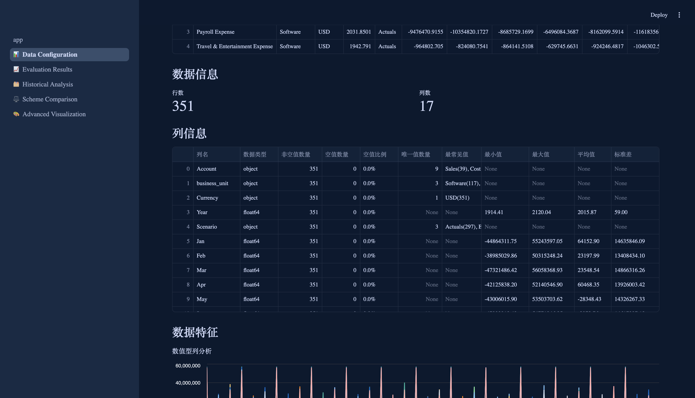
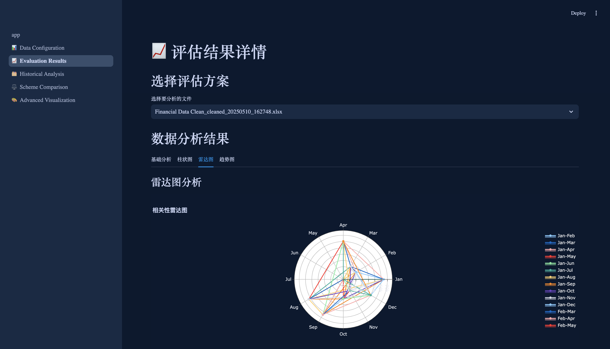
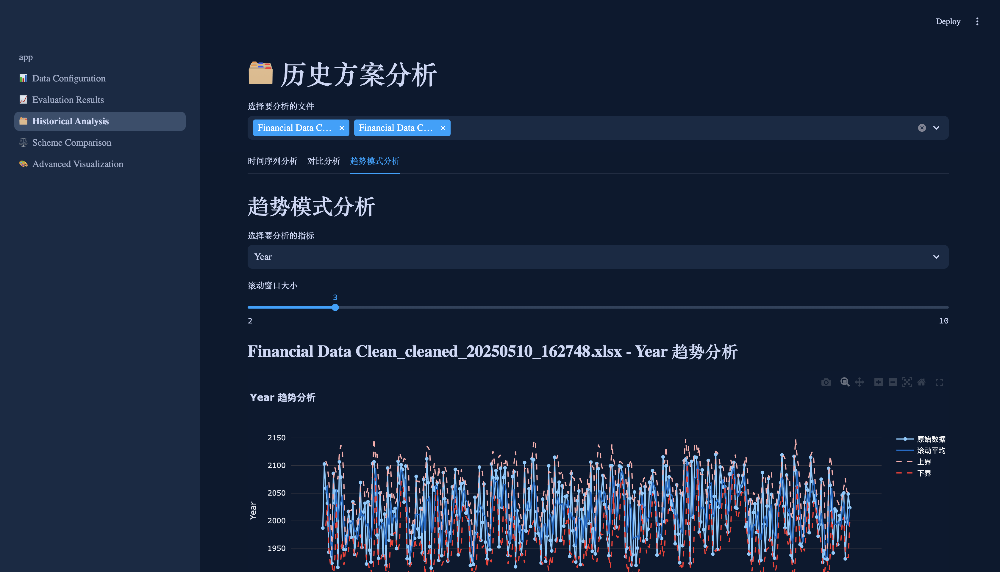
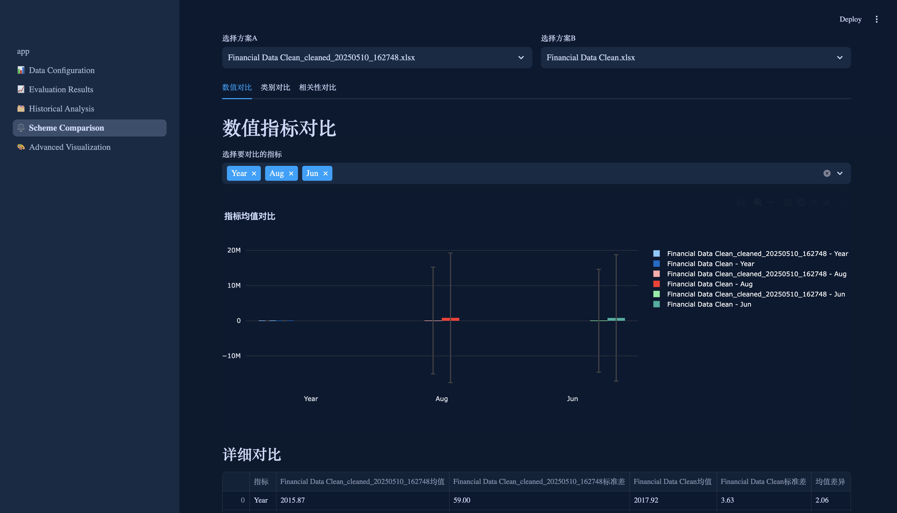
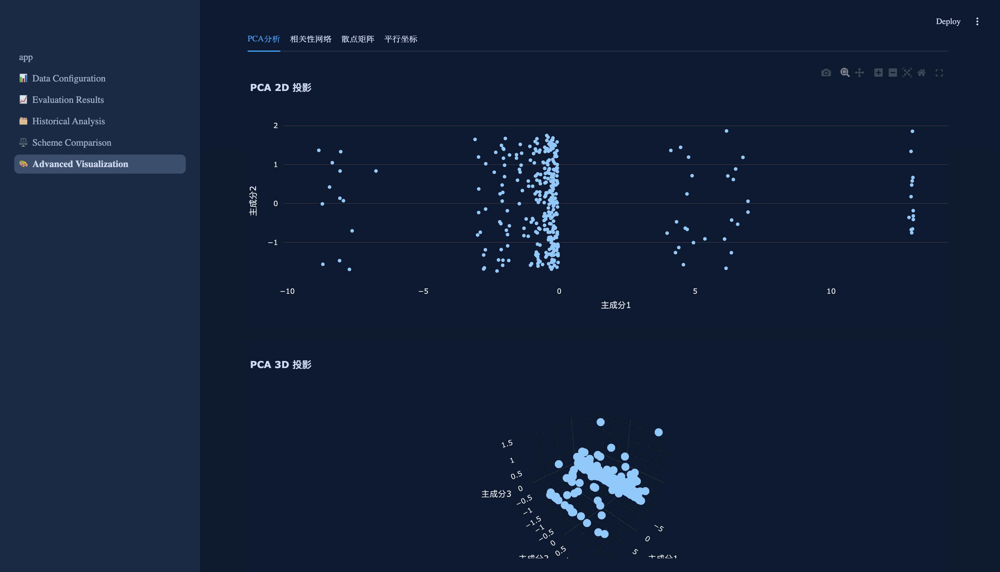

# DataViz Pro - 数据可视化专家

## 项目简介
DataViz Pro 是一个专业的数据可视化分析平台，专注于数据特征分析、多维度可视化和方案对比。通过智能的数据处理引擎和丰富的可视化组件，帮助用户快速洞察数据特征、发现数据模式、进行深度分析和方案优化。

### 核心优势
- **智能特征分析**：自动识别数据特征，提供专业的分析建议
- **多维度可视化**：支持多种图表类型，满足不同分析场景
- **深度数据洞察**：通过高级分析算法，挖掘数据潜在价值
- **灵活方案对比**：支持多方案并行对比，辅助决策优化
- **交互式体验**：直观的操作界面，流畅的交互体验

## 功能特点

### 数据配置与管理
- **智能数据导入**
  - 支持多种数据格式（Excel, CSV, JSON, Parquet）
  - 自动数据格式识别
  - 智能编码检测
  - 数据预览与验证

- **特征工程**
  - 自动特征识别与分类
  - 特征重要性分析
  - 特征相关性分析
  - 特征分布分析

- **数据清洗**
  - 智能缺失值处理
  - 异常值检测与处理
  - 数据格式标准化
  - 重复数据清理

### 分析结果展示
- **多维度可视化**
  - 基础统计图表
  - 高级分析图表
  - 交互式图表
  - 自定义图表

- **深度分析**
  - 趋势分析
  - 相关性分析
  - 分布分析
  - 预测分析

### 历史数据分析
- **时间序列分析**
  - 趋势分解
  - 季节性分析
  - 周期性分析
  - 预测分析

- **对比分析**
  - 时间维度对比
  - 特征维度对比
  - 方案效果对比
  - 优化建议

### 方案对比
- **多方案并行**
  - 方案特征对比
  - 效果差异分析
  - 优化空间评估
  - 决策建议

- **可视化对比**
  - 多维度对比图表
  - 差异热力图
  - 雷达图对比
  - 趋势对比

### 深度可视化
- **降维分析**
  - PCA主成分分析
  - t-SNE降维
  - UMAP流形学习
  - 聚类可视化

- **网络分析**
  - 相关性网络
  - 层次结构分析
  - 动态网络分析
  - 社区发现

## 技术架构

### 技术栈
```
前端框架：
- Streamlit >= 1.32.0
- Plotly >= 5.18.0
- Graphviz >= 0.20.0

数据处理：
- Pandas >= 2.2.0
- NumPy >= 1.26.0
- Scikit-learn >= 1.5.0

开发工具：
- Python >= 3.8
- Git
- Docker (可选)
```

### 项目结构
```
project_root/
├── app.py                 # 主应用入口
├── pages/                 # 页面模块
│   ├── 1_📊_Data_Configuration.py    # 数据配置页面
│   ├── 2_📈_Analysis_Results.py      # 分析结果页面
│   ├── 3_🗂️_Historical_Analysis.py   # 历史分析页面
│   ├── 4_⚖️_Comparison_Analysis.py   # 对比分析页面
│   └── 5_🎨_Advanced_Visualization.py # 深度可视化页面
├── data/                  # 数据目录
│   ├── uploaded_files/    # 上传的数据文件
│   ├── processed_files/   # 处理后的数据文件
│   └── config/           # 配置文件
│       ├── features/     # 特征配置
│       └── rules/        # 处理规则
├── utils/                # 工具函数
│   ├── data_processor.py # 数据处理工具
│   ├── visualizer.py     # 可视化工具
│   ├── validator.py      # 数据验证工具
│   └── cache_manager.py  # 缓存管理工具
├── assets/              # 静态资源
│   ├── css/            # 样式文件
│   │   └── custom_style.css
│   ├── images/         # 图片资源
│   └── icons/          # 图标资源
├── tests/              # 测试目录
│   ├── unit/          # 单元测试
│   ├── integration/   # 集成测试
│   └── performance/   # 性能测试
└── .streamlit/        # Streamlit配置
    └── config.toml    # 主题和服务器配置
```

## 安装说明

1. 创建虚拟环境：
```bash
python -m venv venv
source venv/bin/activate  # Linux/Mac
# 或
venv\Scripts\activate  # Windows
```

2. 安装依赖：
```bash
pip install -r requirements.txt
```

3. 运行应用：
```bash
streamlit run app.py
```

## 使用指南

### 数据导入
1. 准备数据文件（支持Excel、CSV、JSON、Parquet格式）
2. 在数据配置页面点击"上传文件"
3. 等待系统自动分析数据特征
4. 查看数据预览和特征分析结果

### 数据分析
1. 选择需要分析的数据集
2. 选择分析维度和方法
3. 查看分析结果和可视化图表
4. 导出分析报告

### 方案对比
1. 选择需要对比的方案
2. 设置对比维度和指标
3. 查看对比结果和差异分析
4. 获取优化建议

## 配置说明

### 数据配置
```json
{
  "data_config": {
    "file_types": ["xlsx", "csv", "json", "parquet"],
    "max_size_mb": 100,
    "encoding": "utf-8",
    "date_formats": ["%Y-%m-%d", "%Y/%m/%d", "%d-%m-%Y"],
    "numeric_precision": 2,
    "categorical_threshold": 0.1
  }
}
```

### 可视化配置
```json
{
  "theme_config": {
    "primary_color": "#1E88E5",
    "secondary_color": "#42A5F5",
    "background_color": "#121212",
    "text_color": "#FFFFFF",
    "font_family": "Roboto",
    "font_size": 14
  }
}
```

## 项目截图

### 数据配置页面

- 文件上传与管理
- 数据特征分析
- 动态列映射
- 数据预览

### 分析结果页面

- 多维度数据可视化
- 动态数据特征提取
- 相关性分析
- 趋势分析

### 历史分析页面

- 时间序列分析
- 对比分析
- 模式识别

### 方案对比页面

- 动态数据特征对比
- 多维度可视化
- 相关性差异分析

### 深度可视化页面

- PCA降维分析
- 相关性网络
- 散点矩阵
- 平行坐标图

## 更新日志
详细的更新日志请查看 [CHANGELOG_CN.md](CHANGELOG_CN.md)

## 贡献指南
欢迎提交 Issue 和 Pull Request 来帮助改进项目。在提交代码前，请确保：
1. 代码符合项目的编码规范
2. 添加了必要的测试用例
3. 更新了相关文档
4. 所有测试都能通过

## 许可证
本项目采用 MIT 许可证，详情请查看 [LICENSE](LICENSE) 文件。 